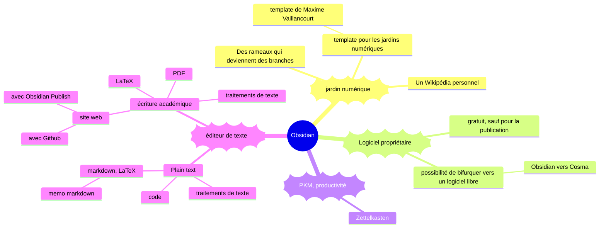

mermaid permet de faire des diagrammes facilement intégrables dans d'autres outils : pie charts, flow charts, diagrammes, etc. 

[source](https://mermaid.live/edit#pako:eNp9k0tu20AMhq9CaGUDzgW0jdEuGqMGmj5QeENpKJv1PJQZju0iyIF0Dl2sVFxZalpUK83wG_Ln67mog6GiLBx747DdeYAYgiwWH6vEhtEvl8MdwHL5A6NhDz67vov8lGmxuJoAhFxrUQjakCNYSnCF04xOI1yWXAe_aBAavLOEzXK0zBwZgg1e2BF8QbYWfa2eZQTXGiGiI8wXeMqs9InJe_KivwmqqPxhivjZw1c-ctt3mhG0FFNQ2P5T0HkASbm78y3zh7DnmslCG0Mbue8EOc7S30eUzLKChLn5XQONkyvLNQoHP0Wah8rJ3FJvQ0pcsWXpuyH5ipsctWoRTioXsgc7irBcRZpKNjbqCt6H5HDUvf2wWQ2aTa6FT4PrSTPAdxIhe8Qk5McXQ4WEVL9KELrILMmtRe3-cDlrV0TFndY93V5M1mG0ppPDeDTh7FfwgI_0bTK8GsmFGzGa-q6OLDkSYI2m79wwRtO77frddHjj8__CktrgTNVcA56onmq5HXqXDn8B71kOufpT-_UrVoWj6JCNbtPzQOwKOaiEXVHqr6EGs5VdsfMvimKW8Omnr4tSYqZVEUPeH4qyQZv0lFujO7Bm1MFyt1sdSglxc93X17V9-QV8kzPx)