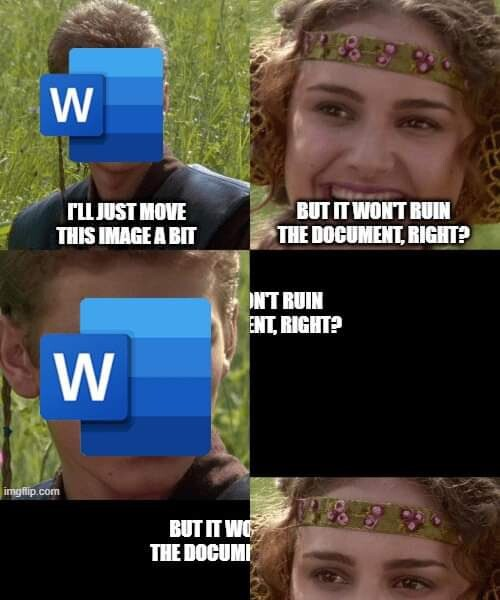

---
tags:
  - référence
---

Depuis 1984, ceux qui écrivent de la poésie et ceux qui écrivent du code, à quelques exceptions près, n'écrivent plus sur le même support numérique. (le traitement de texte Wordstar vendu à partir de 1978 avec la microinformatique de l'époque (MSDos) permettait auparavant d'écrire des codes exécutables en même temps que des textes imprimables et formatés pour être lisibles sans changer de logiciel)

L'essor du traitement de texte -qui ne permet plus d'écrire du code- a eu pour corrolaire le développement séparé des éditeurs de texte orientés langages de programmation. ([référence à placer](https://eriac.hypotheses.org/80))

>Nous avons donc perdu progressivement la capacité d’écrire dans un langage interprétable par la machine

Un traitement de texte est fait pour vous faciliter certaines mises en page de façon automatique : il prend en charge (tout en les invisibilisant) des opérations sous-jacentes.  Cela vous fait gagner du temps mais jusqu'à un certain point. 

Le fait de recourir à ces traitements de texte opaques (parce que propriétaires et parce que ne permettant pas d'accéder à la liste des opérations) constitue un danger pour écrire la science (Cela comporte un risque d'erreur du au manque de transparence du logiciel). Par ailleurs, le traitement de texte développé par Microsoft est un logiciel de bureautique, idéal pour envoyer des commandes, des reçus, des notes administratives mais pas approprié aux écrits académiques sur certains points. On ne peut pas par exemple placer si on le souhaite disposer les notes de bas de page en notes de marge (style Tufte). La placement des images est toujours un défi avec Word. 

Pour ces besoins moins communs existe depuis les années 90 le langage de programmation orienté édition $\LaTeX$ qui découple le contenu du texte de sa mise en forme. Cela ouvre la voie à des fonctionnalités qui permettent une finesse d'édition plus importante que celle dont sont dotée les traitements de texte. 
Bien sûr, ce langage convient particulièrement aux chercheurs en informatique pour qui l'édition est aussi une affaire de programmation. Mais on voit de plus en plus de chercheurs et chercheuses en Sciences Humaines s'en emparer, sans parler des éditeurs chez qui ils font paraître leurs écrits qui ajoutent $\LaTeX$ à leur chaîne éditoriale. 
